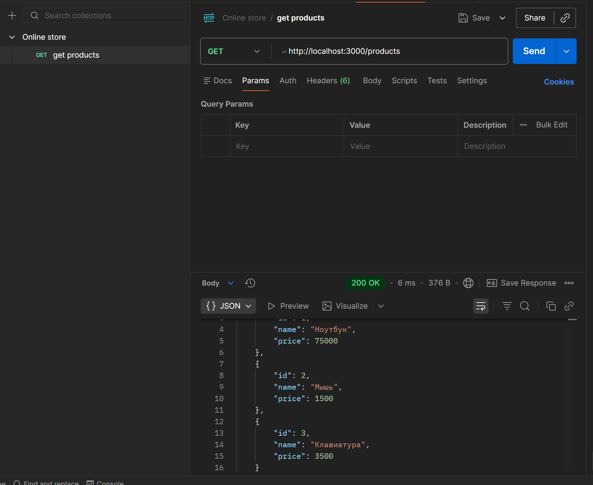
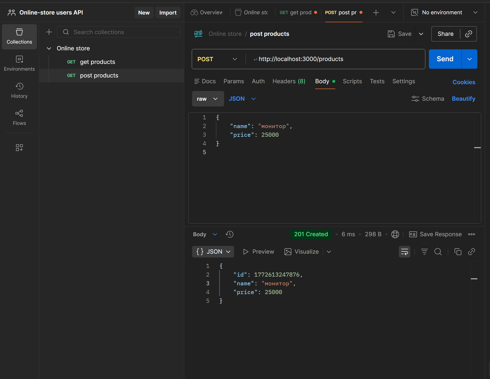
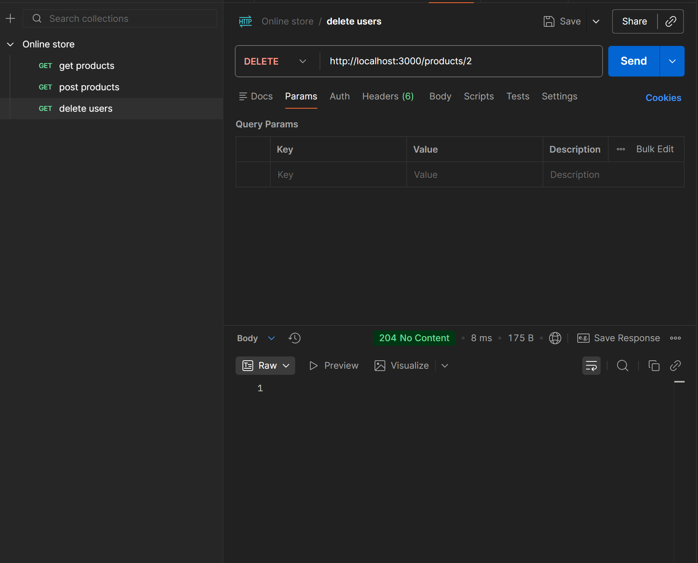
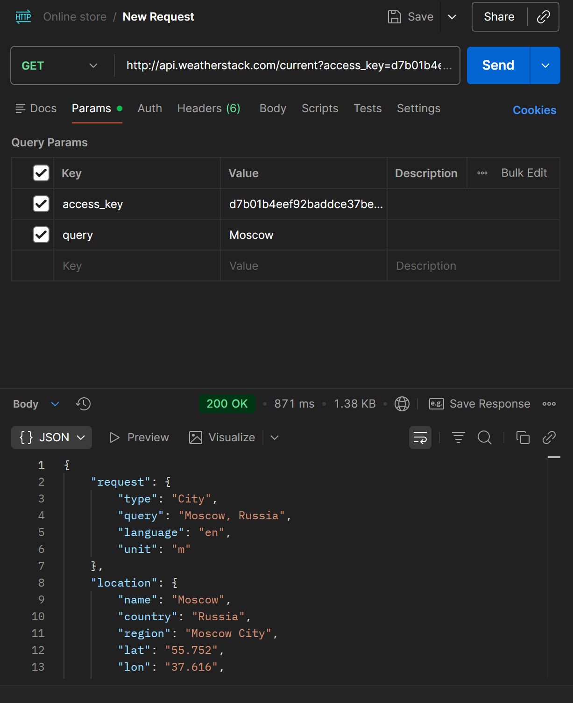
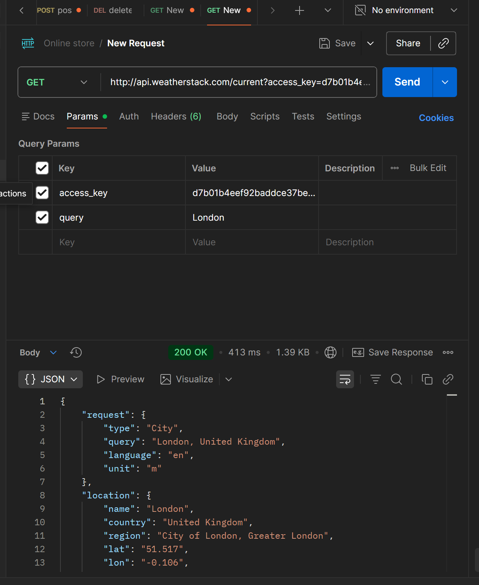
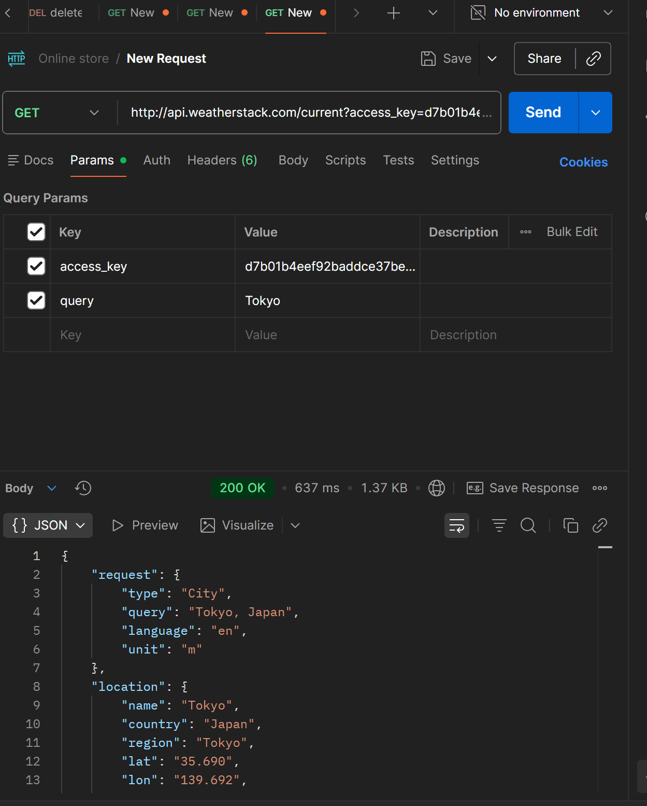
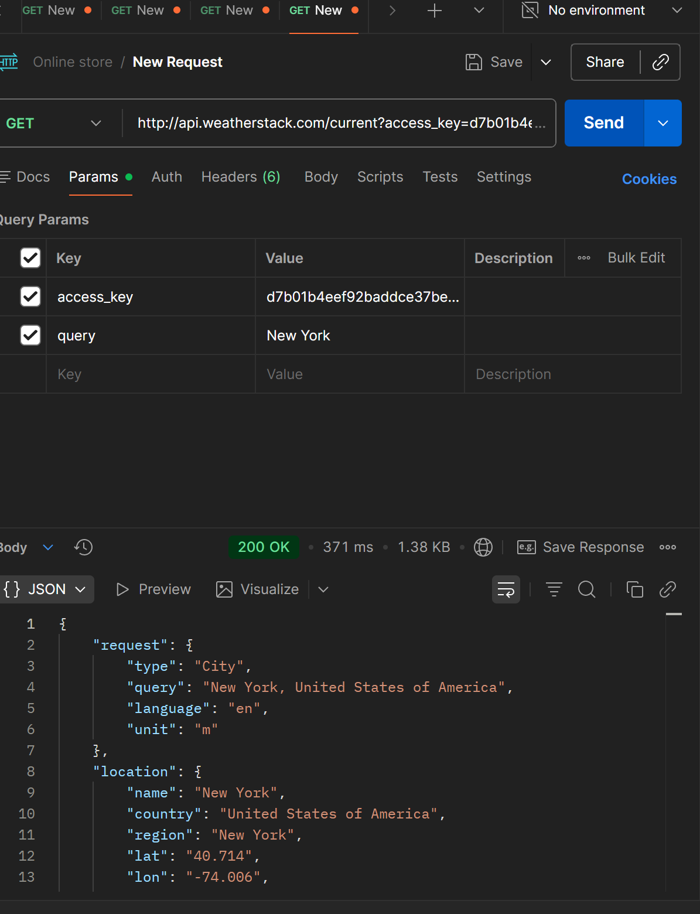
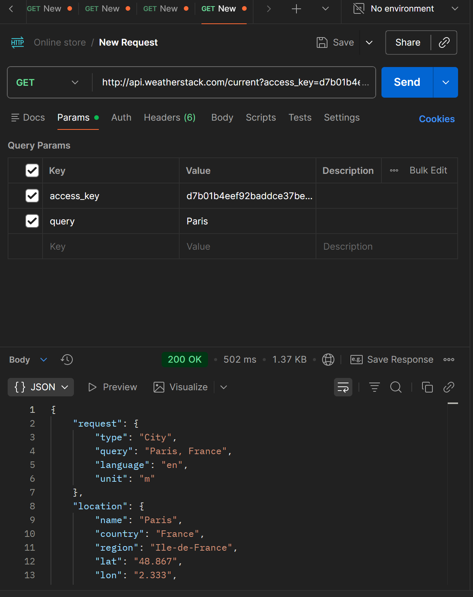

# Практическое занятие 3
## JSON и внешние API

### 1. Тестирование собственного API (3 запроса)

**Запрос 1: GET /products**

**Запрос 2: POST /products**

**Запрос 3: DELETE /products/2**

### 2. Работа с внешним API (5 запросов)

**Запрос 1: Погода в Москве**

**Запрос 2: Погода в Лондоне**

**Запрос 3: Погода в Токио**

**Запрос 4: Погода в Нью-Йорке**

**Запрос 5: Погода в Париже**
